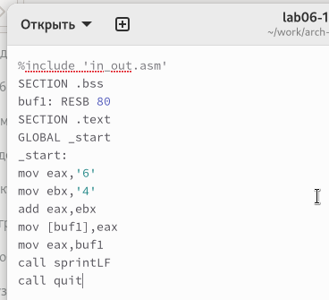
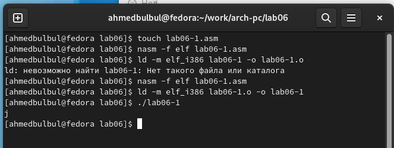
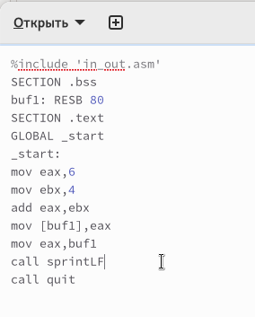
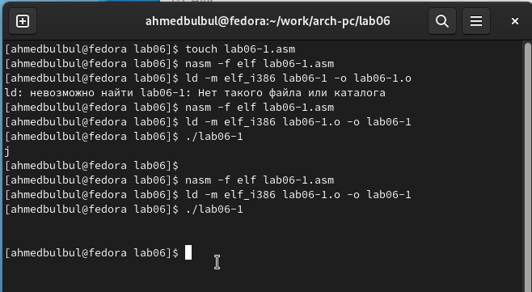
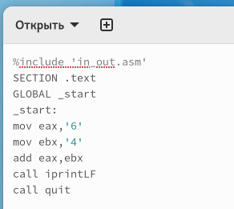
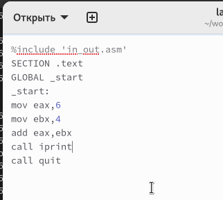
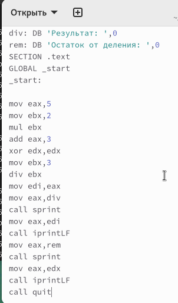
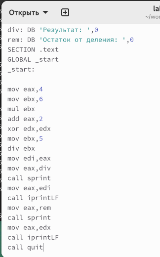
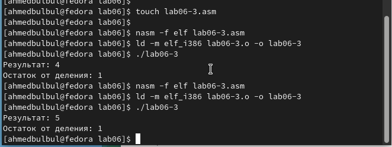
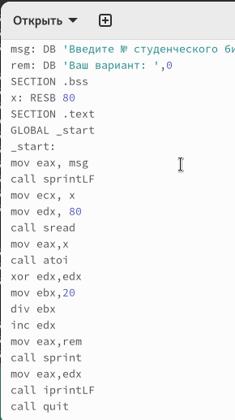

---
## Front matter
title: "Отчёт по лабораторной работе 6"
subtitle: "Арифметические операции в NASM."
author: "Ахмед МД Булбул"

## Generic otions
lang: ru-RU
toc-title: "Содержание"

## Bibliography
bibliography: bib/cite.bib
csl: pandoc/csl/gost-r-7-0-5-2008-numeric.csl

## Pdf output format
toc: true # Table of contents
toc-depth: 2
lof: true # List of figures
lot: true # List of tables
fontsize: 12pt
linestretch: 1.5
papersize: a4
documentclass: scrreprt
## I18n polyglossia
polyglossia-lang:
  name: russian
  options:
	- spelling=modern
	- babelshorthands=true
polyglossia-otherlangs:
  name: english
## I18n babel
babel-lang: russian
babel-otherlangs: english
## Fonts
mainfont: PT Serif
romanfont: PT Serif
sansfont: PT Sans
monofont: PT Mono
mainfontoptions: Ligatures=TeX
romanfontoptions: Ligatures=TeX
sansfontoptions: Ligatures=TeX,Scale=MatchLowercase
monofontoptions: Scale=MatchLowercase,Scale=0.9
## Biblatex
biblatex: true
biblio-style: "gost-numeric"
biblatexoptions:
  - parentracker=true
  - backend=biber
  - hyperref=auto
  - language=auto
  - autolang=other*
  - citestyle=gost-numeric
## Pandoc-crossref LaTeX customization
figureTitle: "Рис."
tableTitle: "Таблица"
listingTitle: "Листинг"
lofTitle: "Список иллюстраций"
lotTitle: "Список таблиц"
lolTitle: "Листинги"
## Misc options
indent: true
header-includes:
  - \usepackage{indentfirst}
  - \usepackage{float} # keep figures where there are in the text
  - \floatplacement{figure}{H} # keep figures where there are in the text
---

# Цель работы

Целью работы является освоение арифметических инструкций языка ассемблера NASM.

# Выполнение лабораторной работы

1. Создал каталог для программам лабораторной работы № 6, перешел в него и создал файл lab6-1.asm. 

2. Рассмотрим примеры программ вывода символьных и численных значений. 
Программы будут выводить значения, записанные в регистр eax.

{ #fig:001 width=70%, height=70% }

{ #fig:002 width=70%, height=70% }

3. Далее изменяю текст программы и вместо символов, запишем в регистры числа. 

{ #fig:003 width=70%, height=70% }

{ #fig:004 width=70%, height=70% }

Никакой символ не виден, но он есть. Это возврат каретки LF.

4. Как отмечалось выше, для работы с числами в файле in_out.asm реализованы 
подпрограммы для преобразования ASCII символов в числа и обратно. 
Преобразовал текст программы с использованием этих функций.

{ #fig:005 width=70%, height=70% }

{ #fig:006 width=70%, height=70% }

В результате работы программы мы получим число 106. В данном случае, как и в первом, 
команда add складывает коды символов ‘6’ и ‘4’ (54+52=106). 
Однако, в отличии от прошлой программы, функция iprintLF позволяет вывести число, 
а не символ, кодом которого является это число.

5. Аналогично предыдущему примеру изменим символы на числа.

{ #fig:007 width=70%, height=70% }

Функция iprintLF позволяет вывести число и операндами были числа (а не коды символов).
Поэтому получаем число 10.

{ #fig:008 width=70%, height=70% }

Заменил функцию iprintLF на iprint. Вывод отличается что нет переноса строки.

{ #fig:009 width=70%, height=70% }

{ #fig:010 width=70%, height=70% }

6. В качестве примера выполнения арифметических операций в NASM приведем 
программу вычисления арифметического выражения 
$$f(x) = (5 * 2 + 3)/3$$.

{ #fig:011 width=70%, height=70% }

{ #fig:012 width=70%, height=70% }

Изменил текст программы для вычисления выражения 
$$f(x) = (4 * 6 + 2)/5$$. 
Создал исполняемый файл и проверил его работу.

{ #fig:013 width=70%, height=70% }

{ #fig:014 width=70%, height=70% }

7. В качестве другого примера рассмотрим программу вычисления варианта задания по 
номеру студенческого билета.

{ #fig:015 width=70%, height=70% }

{ #fig:016 width=70%, height=70% }

ответы на вопросы

1. Какие строки листинга отвечают за вывод на экран сообщения ‘Ваш вариант:’?

В строке mov eax,rem значение переменной с фразой 'Ваш вариант:' перекладывается в регистр eax.

Строка call sprint вызывает подпрограмму для вывода строки.

2. Для чего используется следующие инструкции?

mov ecx, x 
mov edx, 80 
call sread

  
mov ecx, x - перемещает значение переменной X в регистр ecx.

mov edx, 80 - устанавливает значение 80 в регистр edx.

call sread - вызывает подпрограмму для чтения значения с консоли.

3. Для чего используется инструкция “call atoi”?

Эта инструкция вызывает подпрограмму, которая преобразует введенные символы в числовой формат.

4. Какие строки листинга отвечают за вычисления варианта?

xor edx,edx - обнуляет регистр edx.

mov ebx,20 - устанавливает значение 20 в регистр ebx.

div ebx - производит деление номера студенческого билета на 20.

inc edx - увеличивает значение регистра edx на 1.

5. В какой регистр записывается остаток от деления при выполнении инструкции “div ebx”?

Остаток от деления записывается в регистр edx.

6. Для чего используется инструкция “inc edx”?

Инструкция inc edx увеличивает значение регистра edx на 1.
 В данном случае, она используется для выполнения формулы вычисления варианта, 
 где требуется добавить 1 к остатку от деления.

7. Какие строки листинга отвечают за вывод на экран результата вычислений? 

mov eax,edx - результат вычислений перекладывается в регистр eax.

call iprintLF - вызывается подпрограмма для вывода результата на экран.

8. Написать программу вычисления выражения y = f(x). Программа должна выводить выражение 
для вычисления, выводить запрос на ввод значения x, 
вычислять заданное выражение в зависимости от введенного x, выводить результат вычислений. 
Вид функции f(x) выбрать из таблицы 6.3 вариантов заданий в соответствии с номером 
полученным при выполнении лабораторной работы. 
Создайте исполняемый файл и проверьте его работу для значений x1 и x2 из 6.3.

Получили вариант 15 - $${(5x + 2)}^2 - 3$$  для $$x=5, x=1$$

{ #fig:017 width=70%, height=70% }

{ #fig:018 width=70%, height=70% }

# Выводы

Изучили работу с арифметическими операциями.
